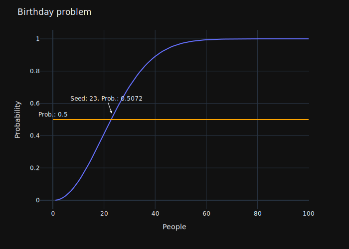
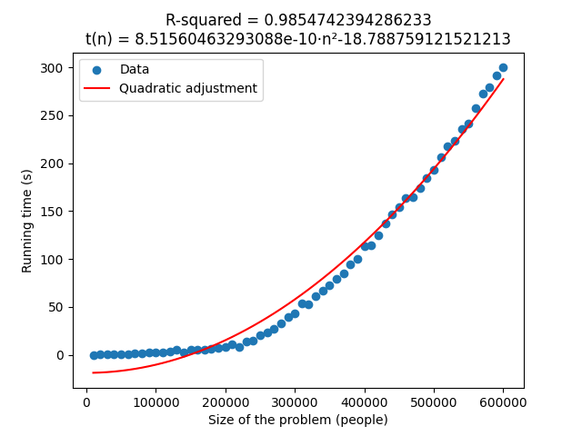

# Introduction
The birthday problem is a probability problem that may appear surprising. It's also called a "paradox" because the initial intuition is often incorrect. Here's an explanation:

Imagine you're in a room with a group of people. The birthday paradox asks: *What's the probability that at least two people in that room share the same birthday?*

At first glance, you might think that a very large group would be needed for two people to share a birthday, because there are 365 days in a year and only a few people in the room. However, as more people are added, the probability that at least two people share the same birthday increases faster than you might expect.

This is due to how combinations work. With just a few people, there are few opportunities for the dates to coincide. But as you add more people, the chances of at least two sharing the same birthday increase dramatically.

Even in a relatively small group, like around 23 people, the probability that at least two share the same birthday is surprisingly high, around 50%. As the group continues to grow, the probability quickly approaches 100%.

This paradox demonstrates how our intuitions about probabilities can be deceptive. We often underestimate how quickly the probability of coincidences increases as we add more elements to the group. It's an interesting example of how mathematics can contradict our initial intuition.

# Goal
The objective of this project is to explain on X (formerly Twitter) how the birthday paradox can be used to calculate the probability that at least two private keys will collide in Bitcoin. You can access to X thread [here](https://twitter.com/VentuLM/status/1697587996344942972) (Spanish).

# Requirements
Open a terminal in the project directory at `birthday_problem/` and type:

    pip install -r requirements.txt

# How to run
Open a terminal in the project directory at `birthday_problem/` and type:

    python3 src/main.py -p 100 -b 365

# Estimating probabilities of Bitcoin PK collision
If you want to estimate some probabilities of private key collision try to modify `p`.

> **Warning**
> Be cautious when increasing the parameter size: execution times can become lengthy, and furthermore, you might run out of memory.

    python3 src/main.py -p 1_000_000 -b 115792089237316195423570985008687907853269984665640564039457584007913129639935

# References

    @online{slimfish_2022,
        date         = {2022},
        organization = {X},
        author       = {Slim Fish},
        url          = {https://twitter.com/SlimFish32/status/1582416260544925704}
    }

    @misc{enwiki:1170666123,
        author = {{Wikipedia contributors}},
        title  = {Birthday problem --- {Wikipedia}{,} The Free Encyclopedia},
        year   = {2023},
        url    = {https://en.wikipedia.org/w/index.php?title=Birthday_problem&oldid=1170666123},
        note   = {[Online; accessed 31-August-2023]}
    }

    @online{derivando_2017,
        title        = {¡¡Cumples años el mismo día que yo!! ¿Casualidad? | PARADOJA DEL CUMPLEAÑOS},
        date         = {2017},
        organization = {YouTube},
        author       = {Derivando},
        url          = {https://www.youtube.com/watch?v=7uzx6D_0V7M}
    }

    @online{mates_mike_2020,
        title        = {La PARADOJA del CUMPLEAÑOS explicada con GATOS},
        date         = {2020},
        organization = {YouTube},
        author       = {Mates Mike},
        url          = {https://www.youtube.com/watch?v=RnTexP9HMMA}
    }

    @book{Aumasson_2018,
        place     = {San Francisco},
        title     = {Serious cryptography: A practical introduction to modern encryption},
        publisher = {No Starch Press},
        author    = {Aumasson, Jean-Philippe},
        year      = {2018}
    } 

